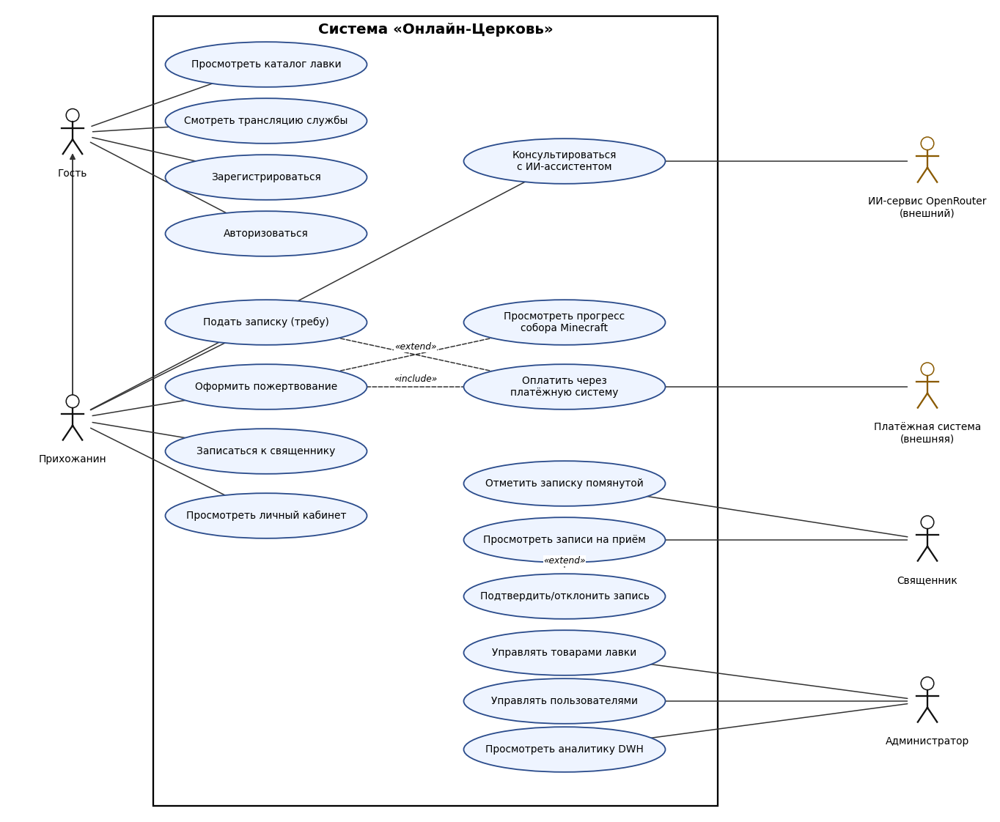
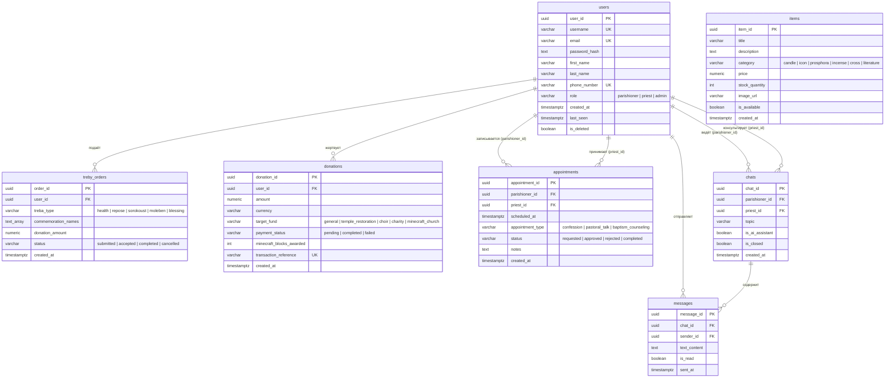

# Online Church — Backend

REST API серверной части сервиса «Онлайн-Церковь» (православный приход): церковная лавка, подача записок (треб), пожертвования, запись к священнику и ИИ-консультант.

## Описание проекта
Пользователи регистрируются в системе, просматривают каталог церковной лавки, подают записки о здравии и об упокоении, жертвуют на фонды (1 рубль = 1 блок собора Minecraft), записываются на беседу к священнику и общаются с ИИ-ассистентом. Священники подтверждают записи, администраторы управляют каталогом и пользователями.

## Стек технологий
| Компонент | Технология |
|---|---|
| Язык / фреймворк | Python 3.12, FastAPI, Uvicorn |
| ORM и валидация | SQLAlchemy 2.0, Pydantic v2 |
| База данных | PostgreSQL 16 (`psycopg2-binary`) |
| ИИ-консультант | OpenRouter API (DeepSeek), клиент `httpx` |
| Инфраструктура | Docker, Docker Compose, GitHub Actions (Ruff + Pytest) |

## Запуск
```bash
docker compose up --build        # из корня репозитория
# API:     http://localhost:8080
# Swagger: http://localhost:8080/docs
```

## Роли пользователей и варианты использования
| Роль | Действия в системе |
|---|---|
| **Гость** | просматривает каталог лавки и трансляции, регистрируется, входит |
| **Прихожанин** | всё, что гость; подаёт записки, оформляет пожертвования, записывается к священнику, консультируется с ИИ, пользуется личным кабинетом |
| **Священник** | просматривает записи на приём, подтверждает или отклоняет их, отмечает записки помянутыми |
| **Администратор** | управляет товарами лавки и пользователями, просматривает аналитику DWH |
| **Платёжная система, ИИ-сервис OpenRouter** | внешние системы, к которым обращается приложение |



Исходник диаграммы (draw.io): [use-case-diagram.drawio](use-case-diagram.drawio)

## Схема БД (ER-диаграмма)
DDL: [docs/church_db_init.sql](../docs/church_db_init.sql)



Таблица `items` не связана внешними ключами: заказы товаров в текущей версии не оформляются.

## API
Полное описание эндпоинтов и JSON-контрактов: [docs/API.md](../docs/API.md). Интерактивная документация доступна в Swagger UI: `/docs`.

| Метод | Путь | Назначение |
|---|---|---|
| GET | `/health` | проверка работоспособности |
| POST | `/api/v1/auth/register`, `/api/v1/auth/login` | регистрация и вход (JWT) |
| GET | `/api/v1/items` | каталог лавки |
| POST | `/api/v1/treby` | подача записки |
| POST | `/api/v1/donations` | пожертвование |
| POST | `/api/v1/appointments` | запись к священнику |
| POST | `/api/v1/chats/ai/messages` | сообщение ИИ-ассистенту |

## Команда
Константин Ващеня (Team Lead), Соболевский Евгений (Backend), Цыро Тамара (Frontend), Нарель Антон (QA).
